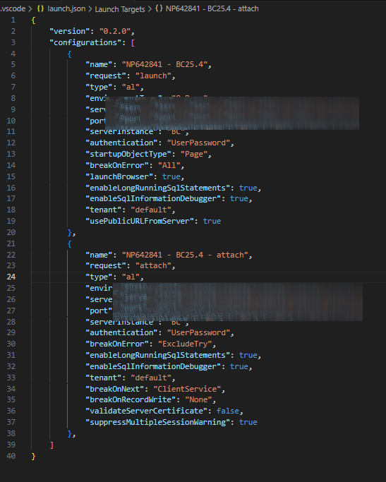

# NaviPartner AL Test Runner

A simple-to-use and efficient test runner for AL development in Business Central.

## What it does

NaviPartner AL Test Runner makes it easy to:

- Run tests directly from VS Code
- Debug tests seamlessly
- Work with any Business Central environment (containers, SaaS, or on-premises, localhost)

## Why use it?

- **Works with any environment** - Run tests against any NST instance regardless of where it's hosted
- **Simplified setup** - Minimal configuration required
- **Seamless integration** - Uses your existing AL extension credentials
- **Native debugging** - Debug tests directly without workarounds

## Requirements

- [VS Code](https://code.visualstudio.com/)
- [AL Language extension](https://marketplace.visualstudio.com/items?itemName=ms-dynamics-smb.al)
- [PWSH 7.0 or higher](https://learn.microsoft.com/en-us/powershell/scripting/install/installing-powershell-on-windows?view=powershell-7.4#installing-the-msi-package)
- Access to a Business Central environment
- BC25 and higher for native debugging experience (otherwise, debugging isn't possible)

## Features

- **Run individual tests** or entire test codeunits
- **Debug tests** with full debugging capabilities
- **SaaS support** - Works with Business Central online sandboxes
- **Flexible connectivity** - Connect to any NST instance regardless of hosting method

## Getting Started

1. Install the extension from the VS Code marketplace
2. Open your AL project in VS Code
3. Make sure `launch.json` contains:  
   - `launch` configuration and you can download symbols and/or publish the app. This is essential.
   - `attach` configuration if you want to debug your tests. The `attach` configuration must contain `"breakOnNext": "ClientService"` which is valid for BC25 and higher versions.
   
4. Authenticate against NST (download symbols or publish the app).
5. Right-click on a test codeunit or test method
6. Select "Run Test" or "Debug Test".
7. You will be asked to provide the following details:
    - Select a `launch` configuration if you have more than one in your `launch.json`.
    - Select an `attach` configuration if you decide to debug and have more than one in the `launch.json`.
    - Select BC version so the test runner can download missing libraries (from the official artifact storage).

No additional configuration needed! The extension automatically uses your existing AL credentials.

